# AWS Glue Workflow Batch Process

## 1. Data 수집

1. 쉽게 DataSet을 얻을 수 있는 [Kaggle](https://www.kaggle.com/)을 검색하여 접속합니다.
   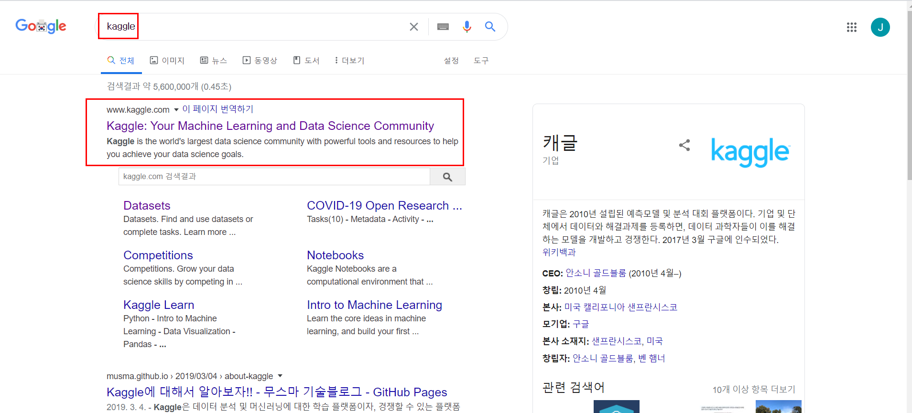

2. Data를 선택하고 고객에 대한 data가 필요하므로 customer를 검색, 소규모 dataset이 필요하므로 small을 선택합니다.

   

3. 2 번째 항목을 선택하고 data를 다운로드 합니다.
   

4. dataset의 원본 형태에는 고객 정보와 고객 매출 정보가 함께 있습니다. 용도에 맞게 분류합니다.
   원본: column 5개 row 200개

   - CustomerID
   - Gender
   - Age
   - Annual Income (k$)
   - Spending Score (1-100)
   
   
   
   수정본: 고객 정보 data, 고객 매출 정보 data 로 분할
   
   고객 정보 data : column 3개 row 100개 (100개씩 2개의 파일로 분할)
   
   - CustomerID
   - Gender
   - Age
   
   
   
   고객 매출 정보 data : data: column 3개 row 100개 (100개씩 2개의 파일로 분할)
   
   - CustomerID
   - Annual Income (k$)
   - Spending Score (1-100)
   
   
   
   분할 결과 : 고객 정보, 고객 매출 정보 csv 파일이 각 2개 씩 존재
   
   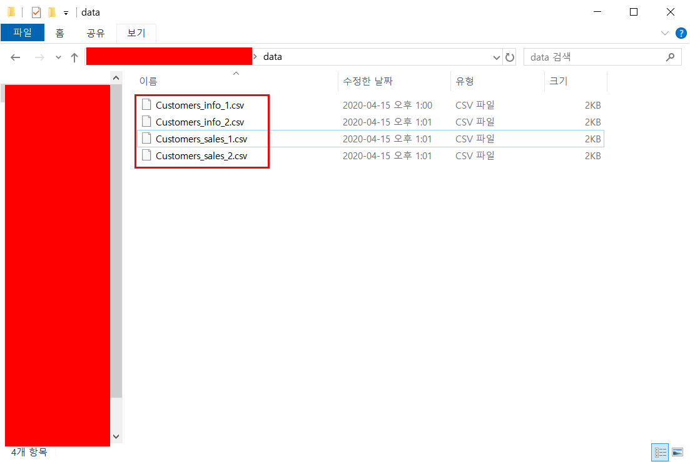

## 2. Dynamodb에 고객 정보 data 적재

1. [AWS Dynamodb](https://console.aws.amazon.com/dynamodb/) 콘솔을 엽니다. **테이블 만들기**를 선택합니다.
   

   

2. 이름과 기본키를 선택하고 생성합니다.
   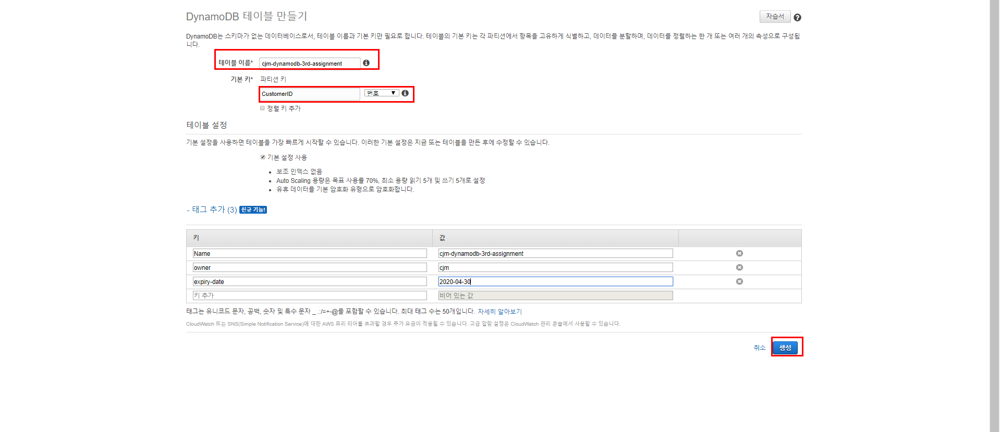

   
   
3. csv파일을 dynamodb에 적재하기 위한 python code 작성

   

   ```python
   # csv 레코드를 dynamo db 테이블에 쓰는 스크립트.
   from __future__ import print_function 
   from __future__ import division 
   import argparse
   import boto3
   import csv
   import time
   
   # command line arguments
   parser = argparse.ArgumentParser(description='Write CSV records to dynamo db table. CSV Header must map to dynamo table field names.')
   parser.add_argument('csvFile', default='{CSV_FILE}', nargs='?', help='Path to csv file location')
   parser.add_argument('table', default='{DynamoDB_Table_Name}', nargs='?', help='Dynamo db table name')
   parser.add_argument('writeRate', default=5, type=int, nargs='?', help='Number of records to write in table per second (default:5)')
   parser.add_argument('delimiter', default=',', nargs='?', help='Delimiter for csv records (default=|)')
   parser.add_argument('region', default='{Region_Name}', nargs='?', help='Dynamo db region name (default=us-west-2')
   args = parser.parse_args()
   print(args)
   
   # dynamodb and table initialization
   endpointUrl = "https://dynamodb." + args.region + ".amazonaws.com"
   dynamodb = boto3.resource('dynamodb', region_name=args.region, endpoint_url=endpointUrl)
   table = dynamodb.Table(args.table)
   
   # write records to dynamo db
   with open(args.csvFile) as csv_file:
       tokens = csv.reader(csv_file, delimiter=args.delimiter)
       # dynamo db 필드 이름을 포함하는 파일의 첫 번째 행을 읽습니다.
       header = next(tokens)
       # 파일의 나머지 부분에는 새로운 레코드가 포함
       for token in tokens:
          item = {}
          for i,val in enumerate(token):
            if val:
              key = header[i]
              item[key] = val
          print(item)
          table.put_item(Item = item)
   
          time.sleep(1/args.writeRate) # 테이블에 대한 최대 쓰기 프로비저닝 용량을 수용
   ```

   

4. 결과 확인
   

   dynamodb table 확인
   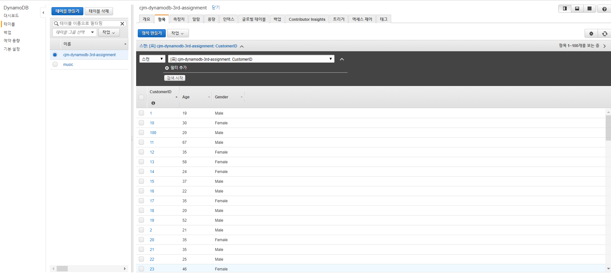

## 3. S3에 data 적재

1. csv파일을 S3에 적재하기 위한 python code 작성

   
   
   ```python
   import boto3
   import time
   
   client = boto3.client('s3')
   bucket_name = '{Bucket_Name}'
   out_file = '{Source_file}'
   new_file_key = "{Target_Key_Path}"
   
   client.upload_file(out_file, bucket_name, new_file_key)
   print("upload clear")
   ```
   
   ```shell
   chmod u+x s3upload.py
   ./s3upload.py
   ```
   
2. 결과 확인하기
   
   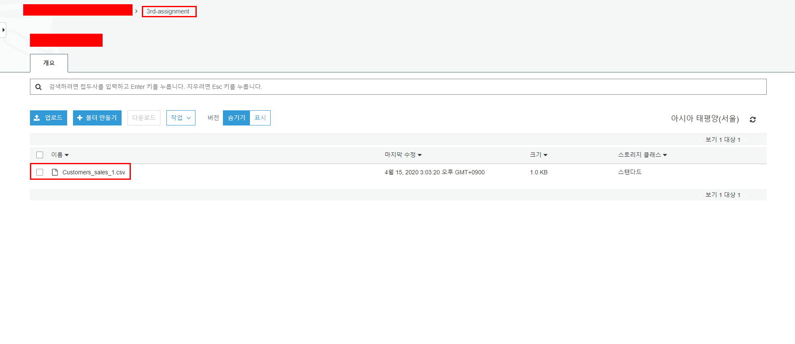

## 4. IAM role 생성(S3, glue service, Dynamodb)

1. IAM 서비스를 선택합니다. 액세스 관리에 있는 **역할**을 선택하고 **역할 만들기**를 선택합니다.
   

2. 신뢰할 수 있는 유형의 개체는 AWS 서비스를 선택합니다. 사용 사례 선택에서는 Glue를 선택하고 **다음**을 선택합니다.

   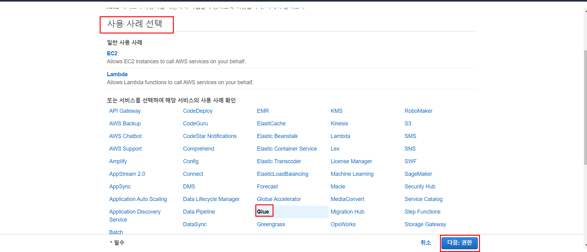

3. S3, Glue, Dynamodb를 차례로 검색하여 정책을 연결합니다.
   

   

   

4. 필요한 태그를 지정합니다.
   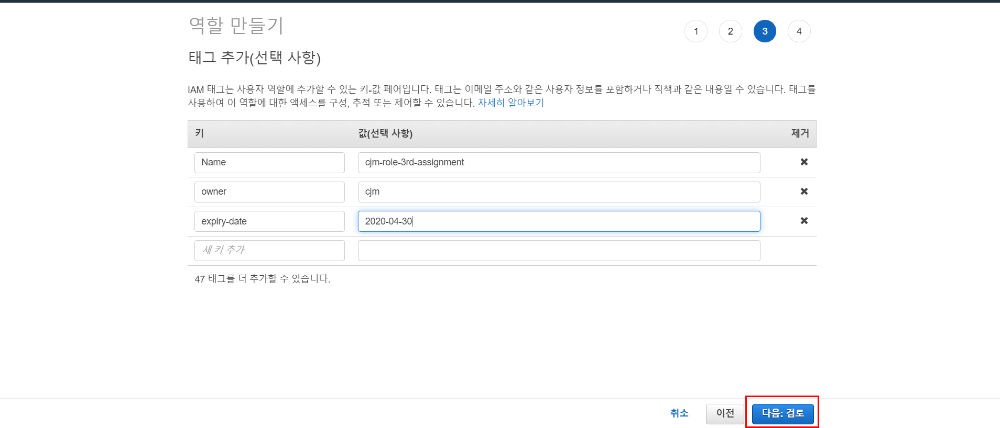

5. 역할에 대한 설정을 검토하고 **역할만들기**를 선택합니다.
   

## 5. Dynamodb data crawling하는 크롤러 생성

1. 데이터 카탈로그에 있는 **크롤러**을 선택하고 **크롤러 추가**를 선택합니다.
   

2. 이름을 설정하고 다음을 선택합니다.
   

3. Dynamodb에서 data를 가져올 것이므로 Data stores를 선택하고 다음을 선택합니다.

   

4. 데이터 스토어와 테이블을 선택합니다.
   

5. **아니오**를 선택합니다.
   

6. 기존에 생성한 IAM을 설정합니다.
   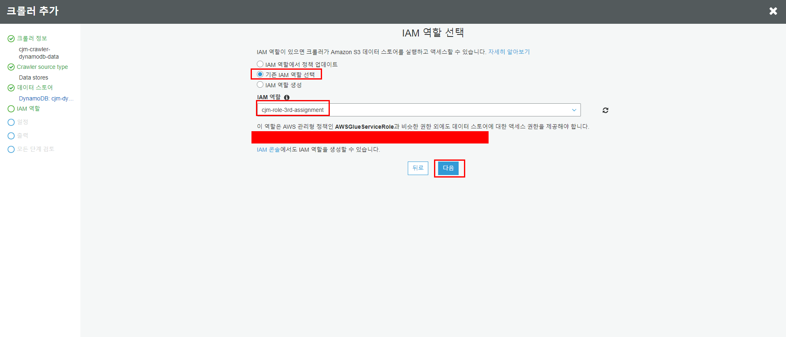

7. **온디맨드**로 설정
   

8. data를 저장할 Database를 새롭게 추가합니다.
   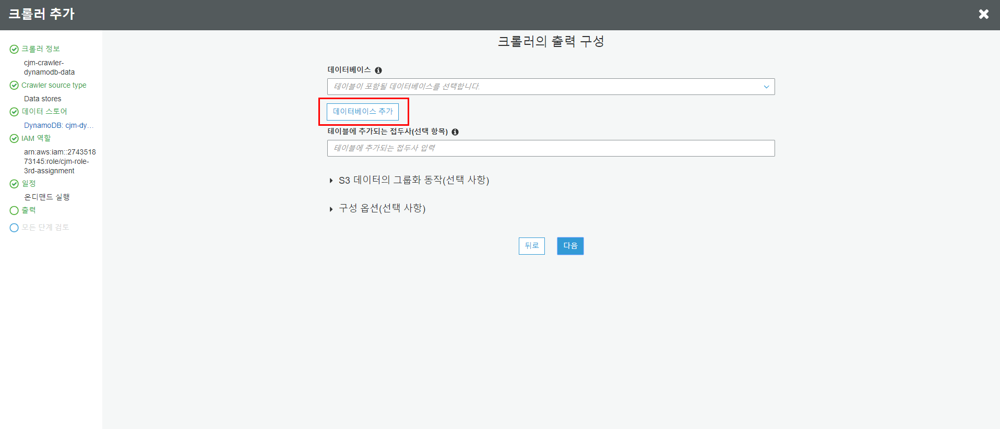
   
   
   
9. 검토 후 생성
   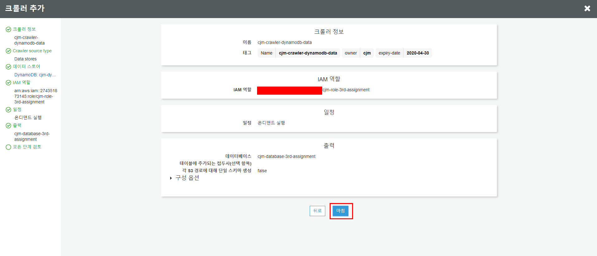

10. 생성된 crawler 실행
    

    실행중
    

    실행 완료
    

11. 확인
    Crawler에서 생성한 Database 선택
    
    테이블 확인
    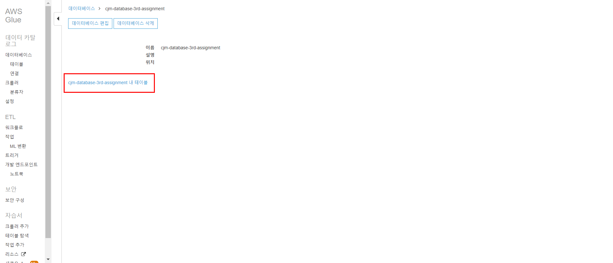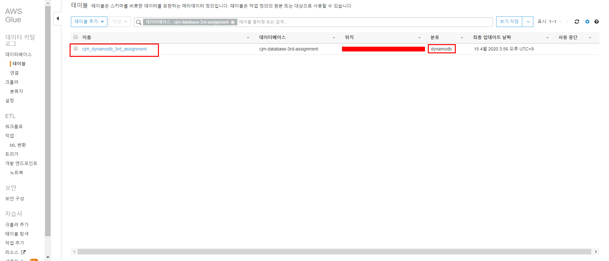
    스키마와 인스턴스 수를 통해 정확하게 crawling되었음을 확인할 수 있습니다.
    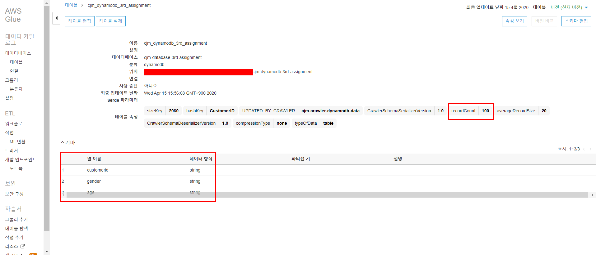

