# AWS Glue Workflow Batch Process

## 1. Data 수집

1. 쉽게 DataSet을 얻을 수 있는 [Kaggle](https://www.kaggle.com/)을 검색하여 접속합니다.
   

2. Data를 선택하고 고객에 대한 data가 필요하므로 customer를 검색, 소규모 dataset이 필요하므로 small을 선택합니다.

   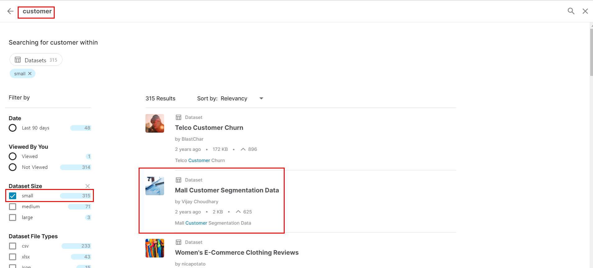

3. 2 번째 항목을 선택하고 data를 다운로드 합니다.
   

4. dataset의 원본 형태에는 고객 정보와 고객 매출 정보가 함께 있습니다. 용도에 맞게 분류합니다.
   원본: column 5개 row 200개

   - CustomerID
   - Gender
   - Age
   - Annual Income (k$)
   - Spending Score (1-100)

   

   수정본: 고객 정보 data, 고객 매출 정보 data 로 분할

   고객 정보 data : column 3개 row 100개 (100개씩 2개의 파일로 분할)

   - CustomerID
   - Gender
   - Age

   

   고객 매출 정보 data : data: column 3개 row 100개 (100개씩 2개의 파일로 분할)

   - CustomerID
   - Annual Income (k$)
   - Spending Score (1-100)

   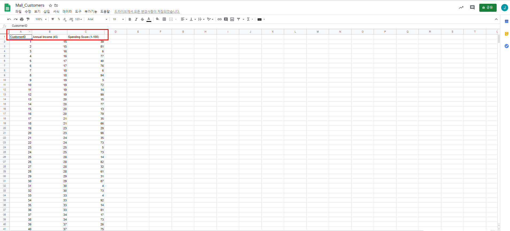

   분할 결과 : 고객 정보, 고객 매출 정보 csv 파일이 각 2개 씩 존재

   

## 2. Dynamodb에 고객 정보 data 적재

1. [AWS Dynamodb](https://console.aws.amazon.com/dynamodb/) 콘솔을 엽니다. **테이블 만들기**를 선택합니다.
   

   

2. 이름과 기본키를 선택하고 생성합니다.
   

   

3. csv파일을 dynamodb에 적재하기 위한 python code 작성

   

   ```python
   # csv 레코드를 dynamo db 테이블에 쓰는 스크립트.
   from __future__ import print_function 
   from __future__ import division 
   import argparse
   import boto3
   import csv
   import time
   
   # command line arguments
   parser = argparse.ArgumentParser(description='Write CSV records to dynamo db table. CSV Header must map to dynamo table field names.')
   parser.add_argument('csvFile', default='{CSV_FILE}', nargs='?', help='Path to csv file location')
   parser.add_argument('table', default='{DynamoDB_Table_Name}', nargs='?', help='Dynamo db table name')
   parser.add_argument('writeRate', default=5, type=int, nargs='?', help='Number of records to write in table per second (default:5)')
   parser.add_argument('delimiter', default=',', nargs='?', help='Delimiter for csv records (default=|)')
   parser.add_argument('region', default='{Region_Name}', nargs='?', help='Dynamo db region name (default=us-west-2')
   args = parser.parse_args()
   print(args)
   
   # dynamodb and table initialization
   endpointUrl = "https://dynamodb." + args.region + ".amazonaws.com"
   dynamodb = boto3.resource('dynamodb', region_name=args.region, endpoint_url=endpointUrl)
   table = dynamodb.Table(args.table)
   
   # write records to dynamo db
   with open(args.csvFile) as csv_file:
       tokens = csv.reader(csv_file, delimiter=args.delimiter)
       # dynamo db 필드 이름을 포함하는 파일의 첫 번째 행을 읽습니다.
       header = next(tokens)
       # 파일의 나머지 부분에는 새로운 레코드가 포함
       for token in tokens:
          item = {}
          for i,val in enumerate(token):
            if val:
              key = header[i]
              item[key] = val
          print(item)
          table.put_item(Item = item)
   
          time.sleep(1/args.writeRate) # 테이블에 대한 최대 쓰기 프로비저닝 용량을 수용
   ```

   

4. 결과 확인
   

   dynamodb table 확인
   

## 3. IAM role 생성(S3, glue service, Dynamodb)

1. IAM 서비스를 선택합니다. 액세스 관리에 있는 **역할**을 선택하고 **역할 만들기**를 선택합니다.
   

2. 신뢰할 수 있는 유형의 개체는 AWS 서비스를 선택합니다. 사용 사례 선택에서는 Glue를 선택하고 **다음**을 선택합니다.

   

3. S3, Glue, Dynamodb를 차례로 검색하여 정책을 연결합니다.
   

   

   

4. 필요한 태그를 지정합니다.
   

5. 역할에 대한 설정을 검토하고 **역할만들기**를 선택합니다.
   

## 4. Glue Crawler 생성 (Dynamodb data)

1. 데이터 카탈로그에 있는 **크롤러**을 선택하고 **크롤러 추가**를 선택합니다.
   

2. 이름을 설정하고 다음을 선택합니다.
   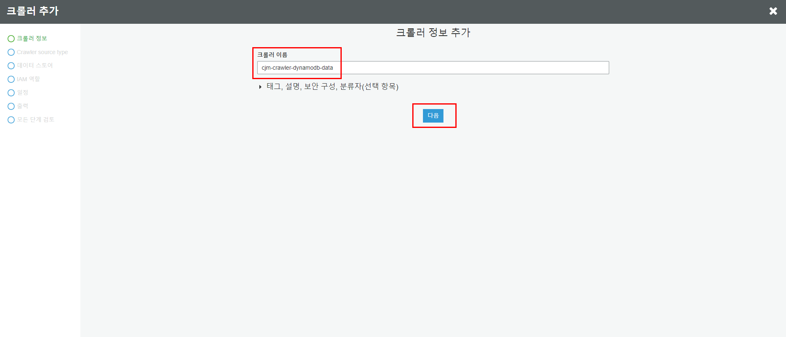

3. Dynamodb에서 data를 가져올 것이므로 Data stores를 선택하고 다음을 선택합니다.

   

4. 데이터 스토어와 테이블을 선택합니다.
   

5. **아니오**를 선택합니다.
   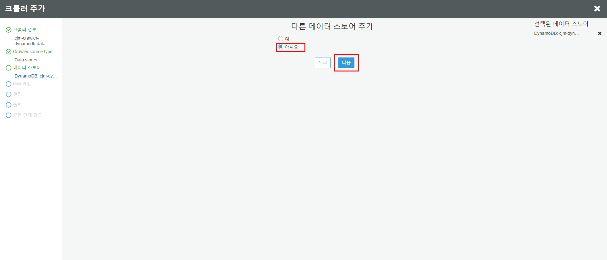

6. 기존에 생성한 IAM을 설정합니다.
   

7. **온디맨드**로 설정
   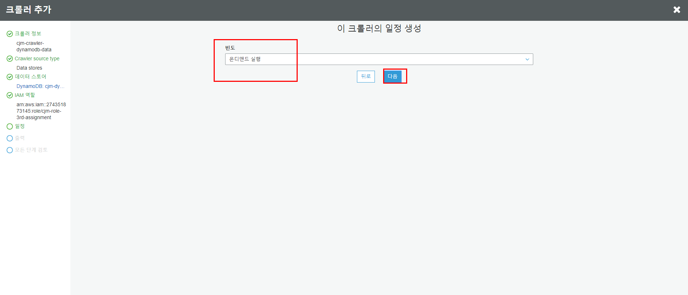

8. data를 저장할 Database를 새롭게 추가합니다.
   

   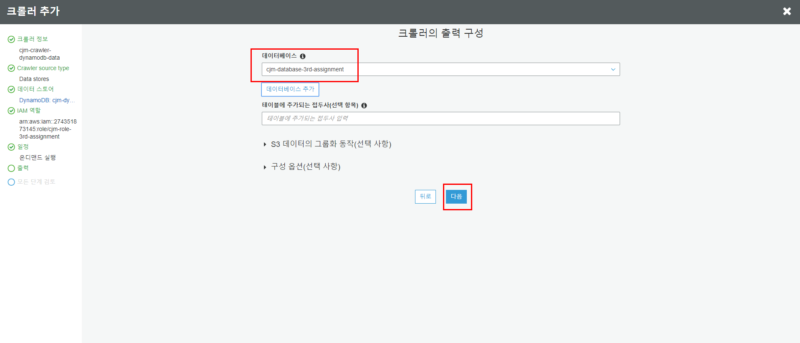

9. 검토 후 생성
   

10. 생성된 crawler 실행
    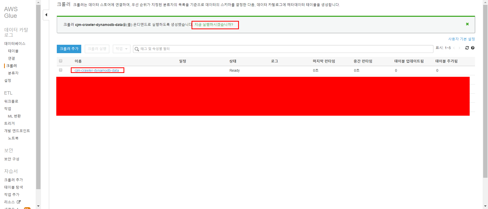

    실행중
    

    실행 완료
    

11. 확인
    Crawler에서 생성한 Database 선택
    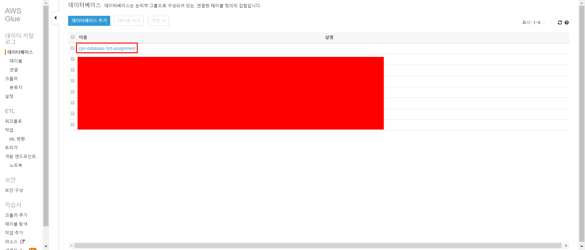
    테이블 확인
    
    스키마와 인스턴스 수를 통해 정확하게 crawling되었음을 확인할 수 있습니다.
    

## 5. Glue Job 생성 (Data S3에 적재)

1. ETL에 있는 **Job**을 선택하고 **작업추가**를 선택합니다.
   

2. 이름과 IAM을 선택, 스크립트가 저장될 경로를 지정합니다.
   

3. Crawling한 테이블을 선택합니다.
   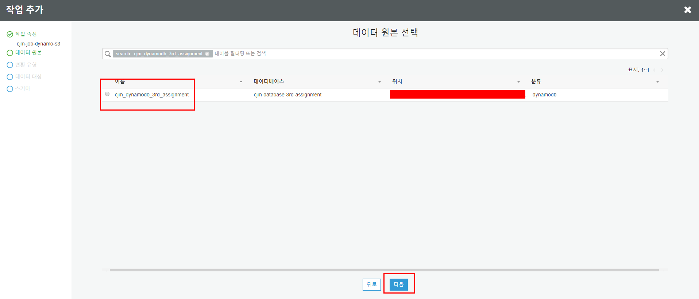**스키마 변경**을 선택합니다.
   

4. **데이터 대상에서 테이블 생성**합니다. 

   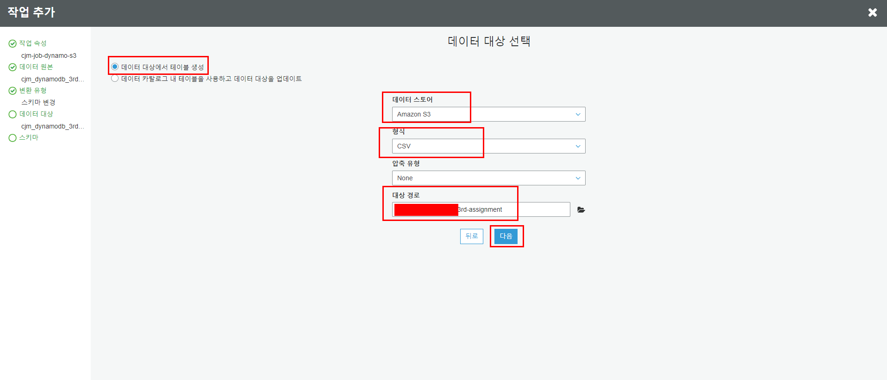

5. 데이터 대상을 편집합니다.

   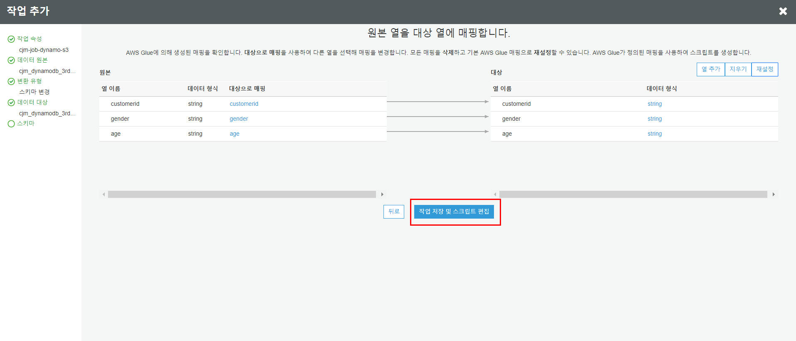

   ```python
   import sys
   from awsglue.transforms import *
   from awsglue.utils import getResolvedOptions
   from pyspark.context import SparkContext
   from awsglue.context import GlueContext
   from awsglue.job import Job
   from pyspark.sql.functions import *
   from awsglue.dynamicframe import DynamicFrame
   from pyspark.sql.types import *
   import os
   
   table_name = "{Catalog Table Name}"
   table = glueContext.create_dynamic_frame.from_options(
     "dynamodb",
     connection_options={
       "dynamodb.input.tableName": table_name
     }
   )
   
   repartition = table.toDF()
   repartition.coalesce(1).write.mode('overwrite').option("header", "true").csv('S3_Key_Path')
   ```

6. 작업 실행
   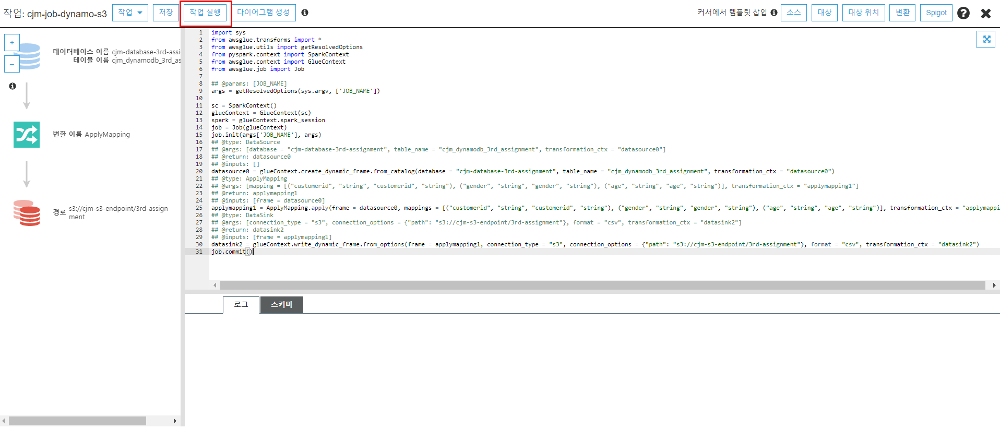

   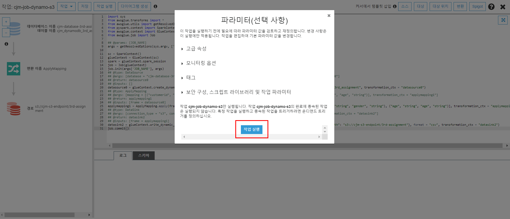

   

7. 완료 결과 확인
   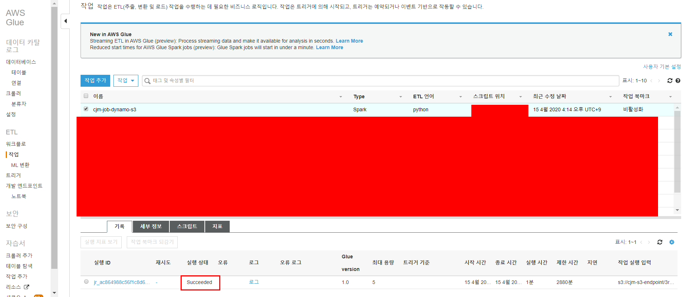

   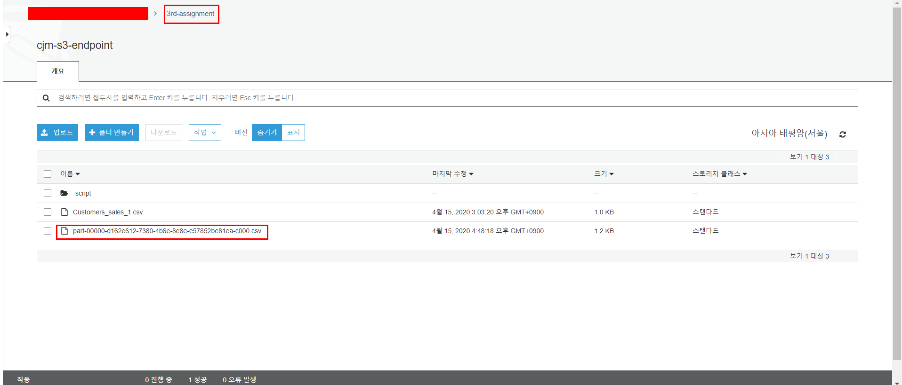

## 6. Glue 개발 Endpoint 생성

1. ETL에 있는 **개발 엔드포인트**을 선택하고 **엔드포인트 추가**를 선택합니다.
   

2. 이름과 IAM을 선택합니다.
   

3. 네트워킹은 인터넷 연결이 되어있는 private vpc와 subnet 선택
   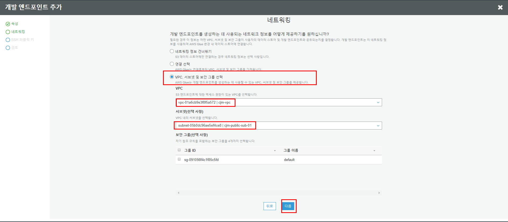

4. 준비되는 중(엔드포인트는 요금이 비싸기 때문에 사용 후 **반드시 삭제**합니다.)
   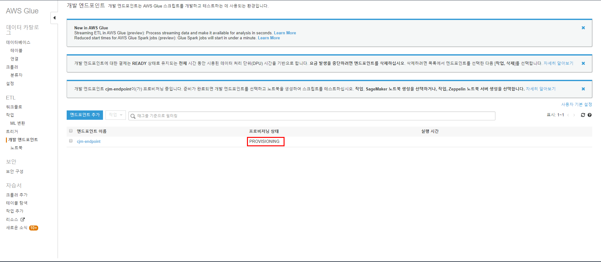

5. 준비가 되면 노트북 생성
   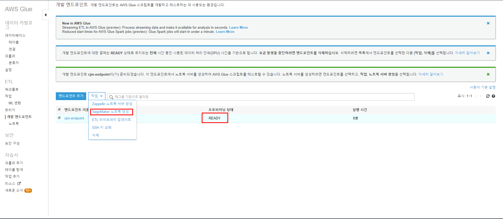

   구성요소들을 설정합니다.
   

   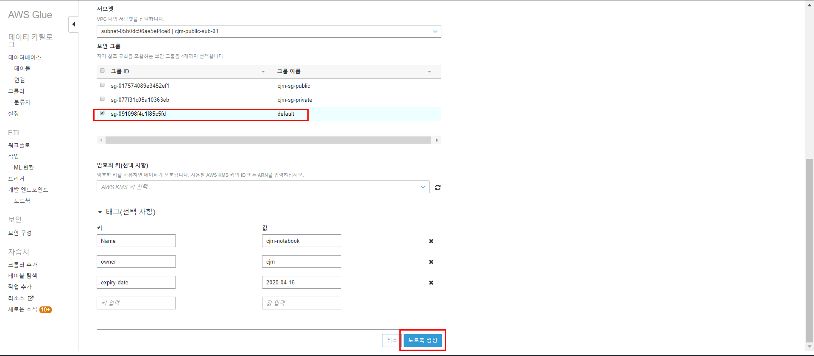

   준비되는 중
   

6. 노트북 시작하기
   

   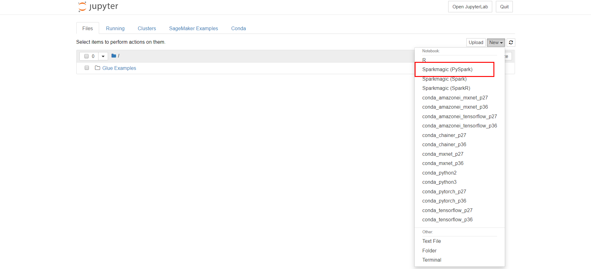

   

7. 코드 작성하기

   ```python
   import sys
   from awsglue.transforms import *
   from awsglue.utils import getResolvedOptions
   from pyspark.context import SparkContext
   from awsglue.context import GlueContext
   from awsglue.job import Job
   from pyspark.sql.functions import *
   from awsglue.dynamicframe import DynamicFrame
   from pyspark.sql.types import *
   ```

   Starting Spark application

   |   ID |            YARN Application ID |    Kind | State |                                                     Spark UI |                                                   Driver log | Current session? |
   | ---: | -----------------------------: | ------: | ----: | -----------------------------------------------------------: | -----------------------------------------------------------: | ---------------: |
   |    0 | application_1586965137568_0001 | pyspark |  idle | [Link](http://ip-172-31-15-246.ap-northeast-2.compute.internal:20888/proxy/application_1586965137568_0001/) | [Link](http://ip-172-31-0-4.ap-northeast-2.compute.internal:8042/node/containerlogs/container_1586965137568_0001_01_000001/livy) |                ✔ |

   SparkSession available as 'spark'.

   ```python
   sc = SparkContext.getOrCreate()
   glueContext = GlueContext(sc)
   spark = glueContext.spark_session
   ```

   ```python
   # 2개의 csv 파일 받아오기
   customer_sale_df_csv = spark.read.format("csv").option("header", "true").load("{S3_Sale_Data_Key_Path}")
   customer_info_df_csv = spark.read.format("csv").option("header", "true").load("{S3_User_Data_Key_Path}")
   ```

   ```python
   # 10개의 record씩 확인
   customer_info_df_csv.show(10)
   customer_sale_df_csv.show(10)
   ```

   ```
   +----------+------+---+
   |customerid|gender|age|
   +----------+------+---+
   |        48|Female| 27|
   |        53|Female| 31|
   |       100|  Male| 20|
   |        39|Female| 36|
   |        73|Female| 60|
   |        99|  Male| 48|
   |         9|  Male| 64|
   |        82|  Male| 38|
   |        78|  Male| 40|
   |        45|Female| 49|
   +----------+------+---+
   only showing top 10 rows
   
   +----------+------------------+----------------------+
   |CustomerID|Annual Income (k$)|Spending Score (1-100)|
   +----------+------------------+----------------------+
   |         1|                15|                    39|
   |         2|                15|                    81|
   |         3|                16|                     6|
   |         4|                16|                    77|
   |         5|                17|                    40|
   |         6|                17|                    76|
   |         7|                18|                     6|
   |         8|                18|                    94|
   |         9|                19|                     3|
   |        10|                19|                    72|
   +----------+------------------+----------------------+
   only showing top 10 rows
   ```

   ```python
   # 스키마 확인
   customer_info_df_csv.printSchema
   customer_sale_df_csv.printSchema
   ```

   ```
   <bound method DataFrame.printSchema of DataFrame[customerid: string, gender: string, age: string]>
   <bound method DataFrame.printSchema of DataFrame[CustomerID: string, Annual Income (k$): string, Spending Score (1-100): string]>
   ```

   ```python
   # 두 테이블 join 후 스키마 확인
   new_customer_csv = customer_info_df_csv.join(customer_sale_df_csv, "CustomerID")
   new_customer_csv.printSchema
   ```

   ```
   <bound method DataFrame.printSchema of DataFrame[customerid: string, gender: string, age: string, Annual Income (k$): string, Spending Score (1-100): string]>
   ```

   ```python
   # customerid 컬럼의 타입을 Integer로 변경
   new_customer_csv = new_customer_csv.withColumn("customerid",new_customer_csv["customerid"].cast(IntegerType())).orderBy(asc("customerid"))
   ```

   ```python
   # join된 table 확인
   new_customer_csv.show(10)
   ```

   ```
   +----------+------+---+------------------+----------------------+
   |customerid|gender|age|Annual Income (k$)|Spending Score (1-100)|
   +----------+------+---+------------------+----------------------+
   |         1|  Male| 19|                15|                    39|
   |         2|  Male| 21|                15|                    81|
   |         3|Female| 20|                16|                     6|
   |         4|Female| 23|                16|                    77|
   |         5|Female| 31|                17|                    40|
   |         6|Female| 22|                17|                    76|
   |         7|Female| 35|                18|                     6|
   |         8|Female| 23|                18|                    94|
   |         9|  Male| 64|                19|                     3|
   |        10|Female| 30|                19|                    72|
   +----------+------+---+------------------+----------------------+
   only showing top 10 rows
   ```

   ```python
   # S3에 join된 table 적재
   new_customer_csv.coalesce(1).write.mode('append').option("header", "true").csv('{S3_Data_Key_Path}')
   ```

   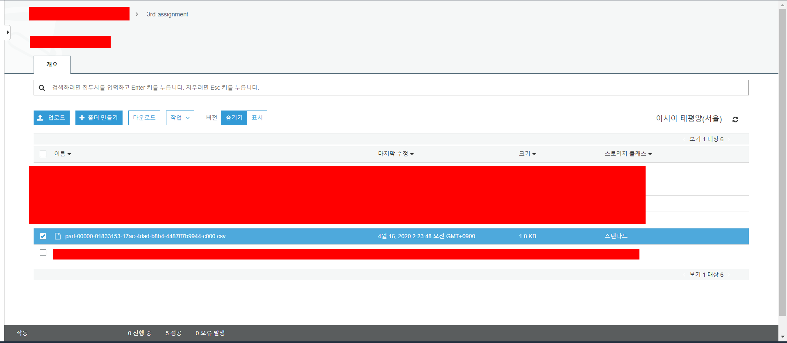

## 7. Glue Job 생성 (S3안의 2 개의 csv join)

1. ETL에 있는 **Job**을 선택하고 **작업추가**를 선택합니다.
   이름과 스크립트 저장 장소 설정 / 사용자가 직접 작성하는 스크립트 선택
   

2. 개발 엔드포인트에서 작성한 코드를 저장한다.
   
   

   ```python
   import sys
   from awsglue.transforms import *
   from awsglue.utils import getResolvedOptions
   from pyspark.context import SparkContext
   from awsglue.context import GlueContext
   from awsglue.job import Job
   from pyspark.sql.functions import *
   from awsglue.dynamicframe import DynamicFrame
   from pyspark.sql.types import *
   
   sc = SparkContext.getOrCreate()
   glueContext = GlueContext(sc)
   spark = glueContext.spark_session
   
   # 2개의 csv 파일 받아오기
   customer_sale_df_csv = spark.read.format("csv").option("header", "true").load("{S3_Sale_Data_Key_Path}")
   customer_info_df_csv = spark.read.format("csv").option("header", "true").load("{S3_User_Data_Key_Path}")
   
   # 두 테이블 join 
   new_customer_csv = customer_info_df_csv.join(customer_sale_df_csv, "CustomerID")
   
   # customerid 컬럼의 타입을 Integer로 변경
   new_customer_csv = new_customer_csv.withColumn("customerid",new_customer_csv["customerid"].cast(IntegerType())).orderBy(asc("customerid"))
   
   # S3에 join된 table 적재
   new_customer_csv.coalesce(1).write.mode('append').option("header", "true").csv('{S3_Data_Key_Path}')
   ```
