# AWS Deletion Code & Unit test

1. [개발 언어 및 활용 라이브러리 선정](#1-개발-언어-및-활용-라이브러리-선정)
2. [Resource 생성](#2-resource-생성)
   - [IAM role 생성](#iam-role-생성)
   - [DynamoDB table 생성](#dynamodb-table-생성)
   - [S3 Bucket 생성](#s3-bucket-생성)
   - [Lambda function 생성](#lambda-function-생성)
   - [Step Function 생성](#step-function-생성)
   - [CloudWatch Event 생성](#cloudWatch-event-생성)
3. [Monitoring Unit Test](#3-monitoring-unit-test)
   - [Collect EC2 Tags](#collect-ec2-tags)
   - [Collect RDS Tags](#collect-rds-tags)
   - [DynamoDB data upload](#dynamodb-data-upload)
   - [Read DynamoDB](#read-dynamodb)
   - [DeletionProtection](#deletionprotection)
   - [Deletion](#deletion)

<div style="page-break-after: always; break-after: page;"></div>

## 1. 개발 언어 및 활용 라이브러리 선정

모니터링 및 삭제를 위한 개발 언어 및 활용 라이브러리 선정

개발 언어 : Python

|      | **Library** | **Description**                                          |
| ---- | ----------- | -------------------------------------------------------- |
| 내부 | Boto3       | aws  resource에 대한 정보 획득                           |
|      | Datetime    | 현재 시간 및 expiry-date와  비교                         |
|      | Time        | expiration-time 생성                                     |
| 외부 | Pandas      | AWS EC2 및  RDS Tag 정보를  저장 및 filtering 및  정형화 |

<div style="page-break-after: always; break-after: page;"></div>

## 2. Resource 생성

### IAM role 생성

> 실제 운영에 사용될 Role이나 Policy를 생성할 때에는 필요 권한 만큼 제어해서 생성을 해야합니다.
> 하지만 편의상 필요한 Resource에 대해 **FullAccess**를 제공
> 실제 생성 시에는 `목록, 읽기, 태그 지정, 쓰기` 등의 권한 중 필요한 권한을 선택한 Policy를 생성하고 그 정책을 Role에 attach 해야합니다.

#### Lambda Function에서 사용할 Role 생성

- 신뢰할 수 있는 유형 : `AWS 서비스`

- 사용 사례 : `Lambda`

  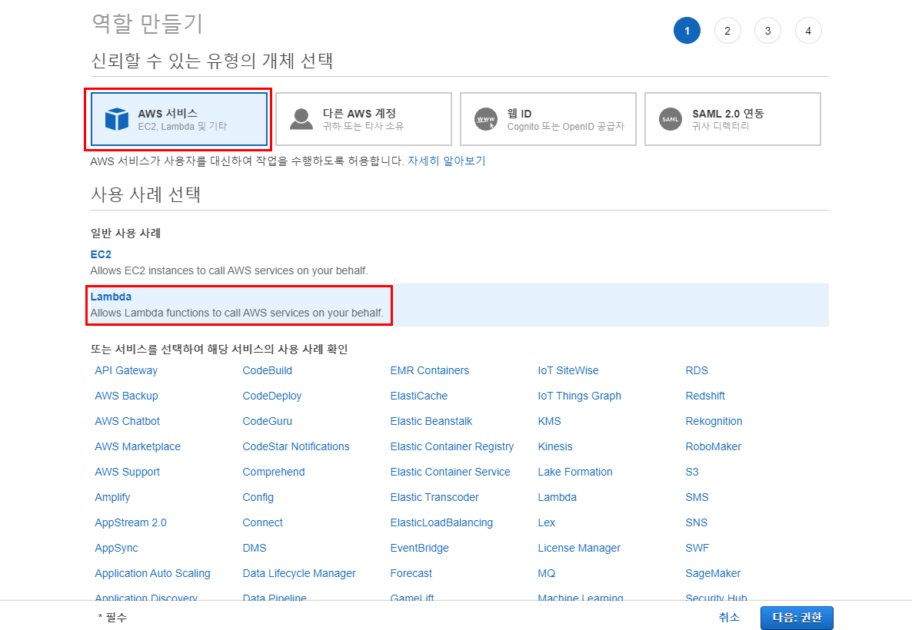

- 권한 정책 연결

  - AmazonEC2FullAccess
  - AmazonRDSFullAccess
  - AmazonS3FullAccess
  - CloudWatchFullAccess
  - AmazonDynamoDBFullAccess

  

- 역할 이름 : `cjm-lambda-role`

- 역할 설명 : `Allows Lambda functions to call AWS services on your behalf. Attached policies are EC2, RDS, S3, CloudWatch, DynamoDB.`

  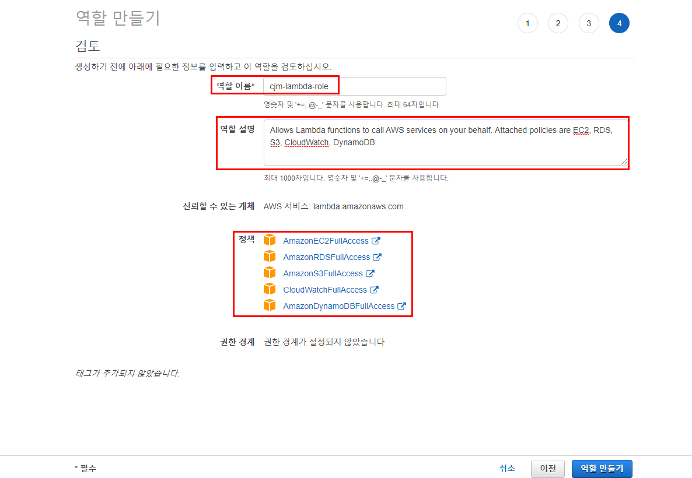

<div style="page-break-after: always; break-after: page;"></div>

#### Step Function에서 사용할 Role 생성

- 신뢰할 수 있는 유형 : `AWS 서비스`

- 사용 사례 : `Step Function`

  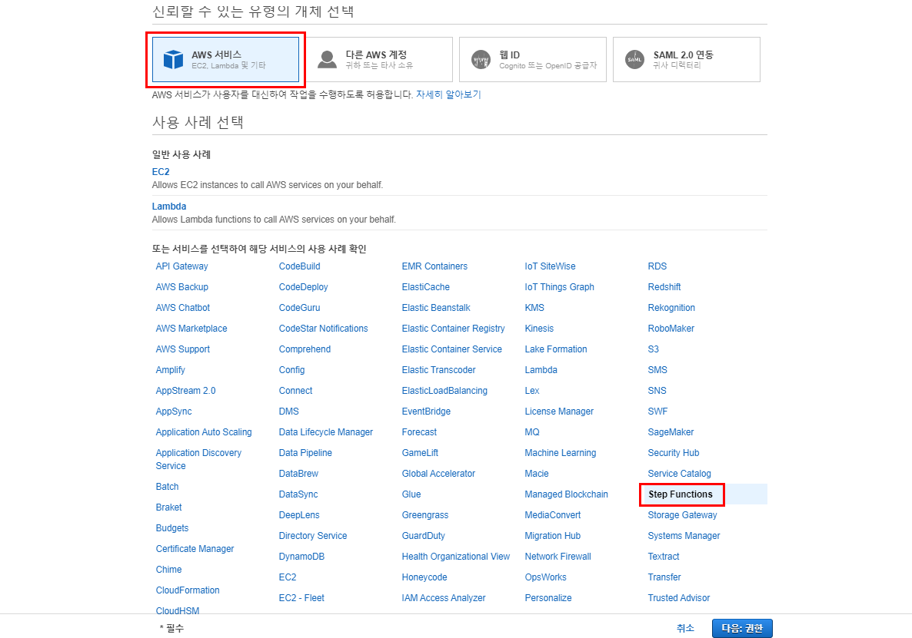

- 권한 정책 연결

  - AmazonLambdaRole

  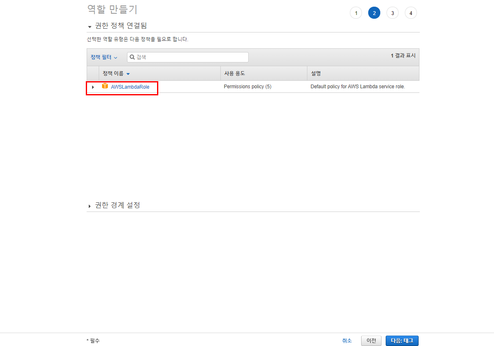

- 역할 이름 : `cjm-stepfunction-role`

- 역할 설명 : `Allows Step Functions to access AWS resources on your behalf. Attached policies are Lambda.`

  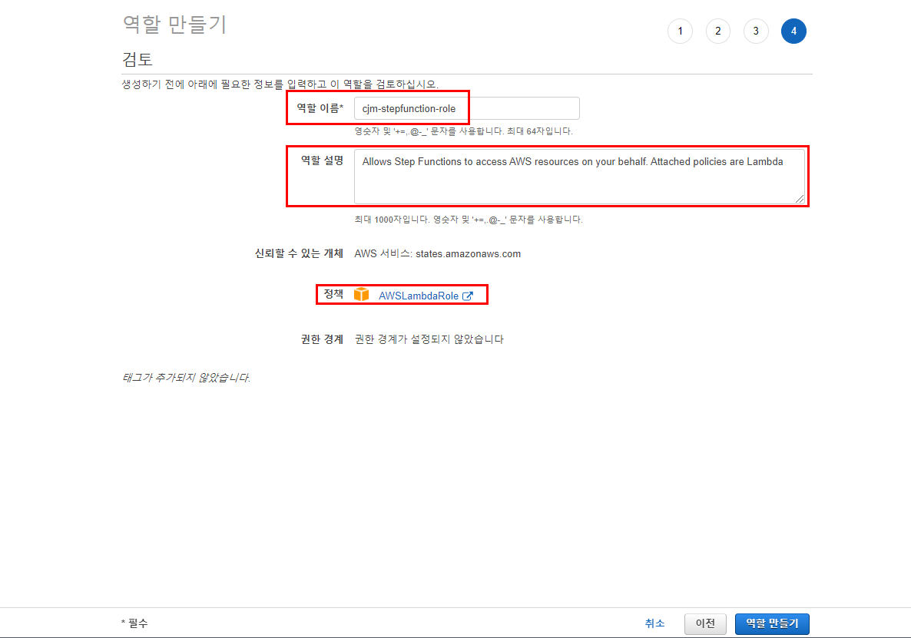

<div style="page-break-after: always; break-after: page;"></div>

#### CloudWatch에서 사용할 Role 생성

##### Step Function 용 Policy 생성

> 편의상 모든 작업 및 모든 항목에 선택을 했지만 실제로는 사용할 Resource를 arn을 통해 제한하고 작업도 필요한 작업만 제한하여 생성

- 서비스 : `Step Function`

- 작업 : `모든 Step Functions 작업(states:*)`

- execution : `이 계정의 모든 항목`

  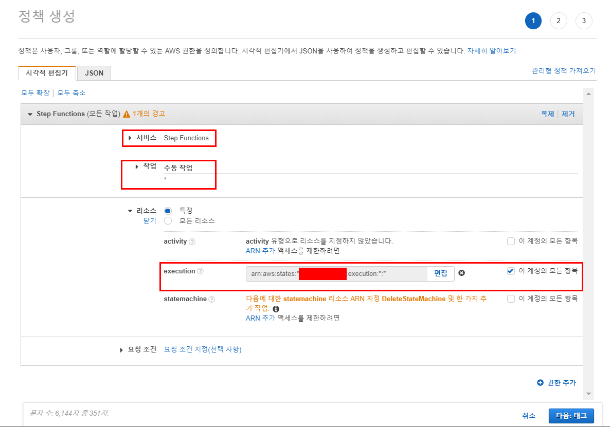

- 이름 : `cjm-stepfunction-policy`

- 설명 : `To execute Step Function`

  

<div style="page-break-after: always; break-after: page;"></div>

##### CloudWatch 용 Role 생성

- 신뢰할 수 있는 유형 : `AWS 서비스`

- 사용 사례 : `CloudWatch Events`

  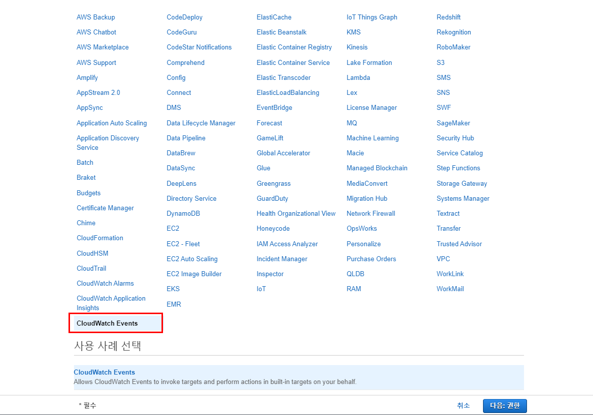

- 권한 정책 연결

  - CloudWatchEventsBuiltInTargetExecutionAccess
  - CloudWatchEventsInvocationAccess

  

- 이름 : `cjm-cloudwatch-role`

- 설명 : `Allows CloudWatch Events to invoke targets and perform actions in built-in targets on your behalf. Attached policies are Step Function.`

  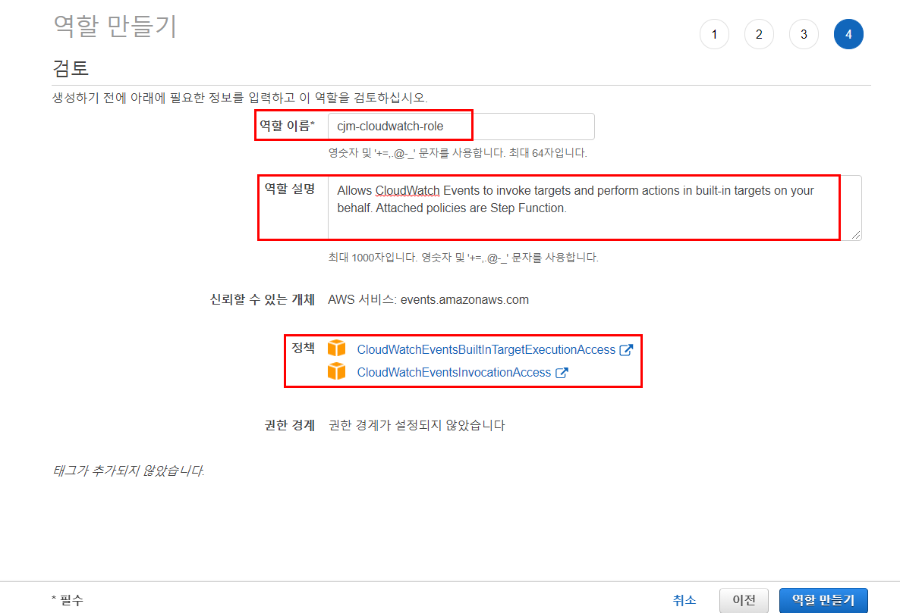

- 생성된 Role에 생성한 Policy 연결

<div style="page-break-after: always; break-after: page;"></div>

### DynamoDB table 생성

- Table Name : `cjm-DynamoDB`

- Partition-Key : `instance-id`

- Sort-Key : `Date`

  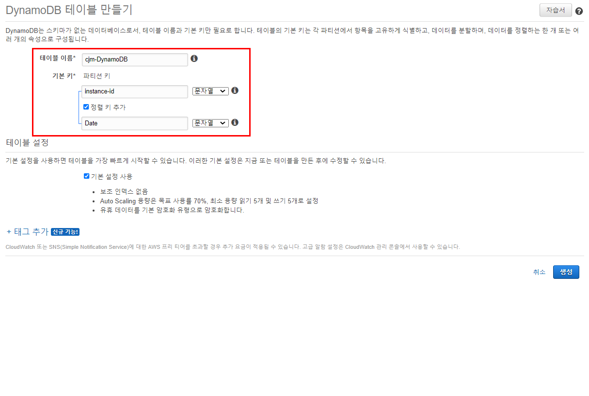

- TTL : `expiration-time`

  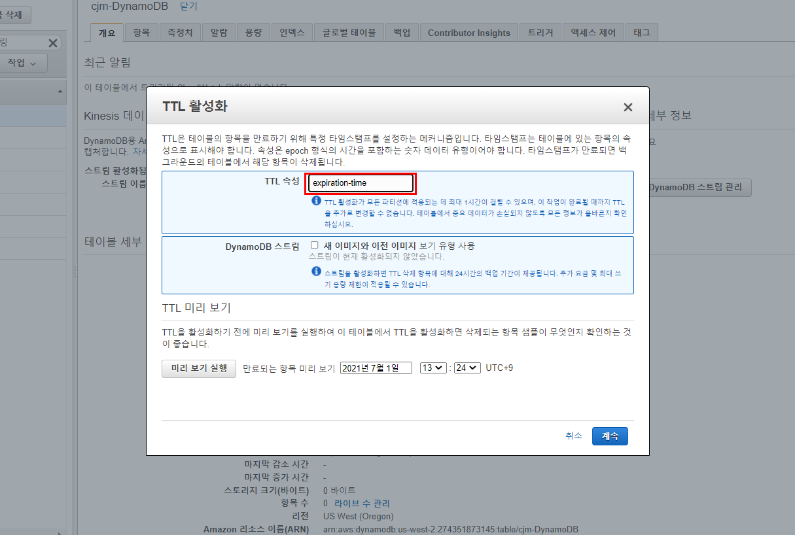

<div style="page-break-after: always; break-after: page;"></div>

### S3 Bucket 생성

- 버킷 이름 : `cjm-bucket`

- AWS 리전 : `미국 서부(오레곤) us-west-2` (Lambda를 생성할 Region으로 설정)

  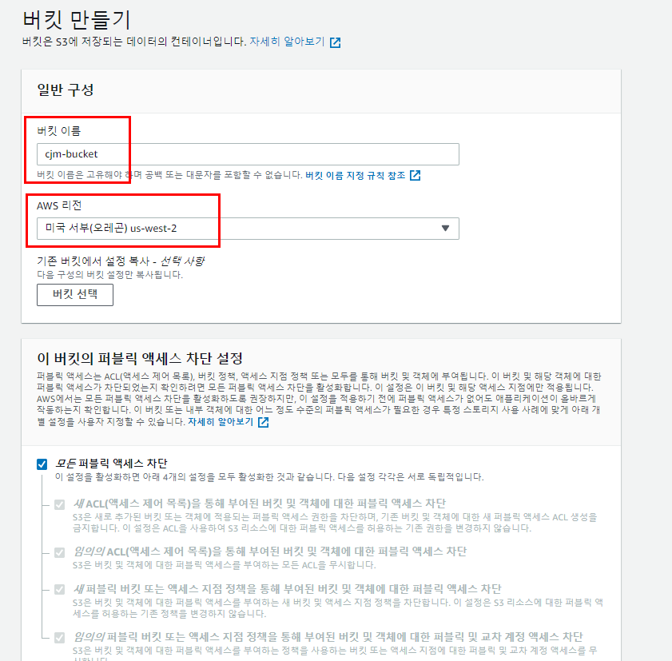

- 버킷 버전 관리 : `비활성화`

  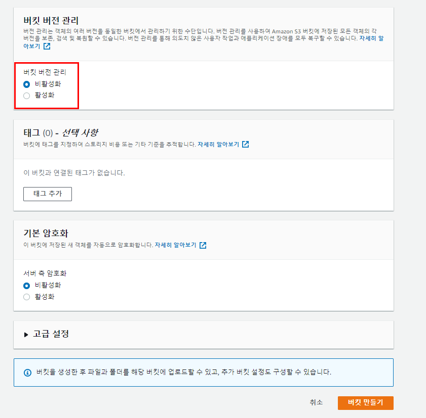

<div style="page-break-after: always; break-after: page;"></div>

### Lambda function 생성

#### Lambda Library 생성

> Lambda는 기본적으로 `Amazon Linux2` 의 Library를 사용하므로 Window나 다른 Linux OS에서 내려받은 Library들은 인식하지 못합니다.
> 따라서 하단 작업은 `Amazon Linux2` EC2에서 하는 것을 권장

필요한 Library : `pandas`

```sh
mkdir python
# library install
pip install {library} --target ./python
# library가 n개일 경우 상단의 내용 n번 진행
zip -r9 {zip_name}.zip .

# s3에 업로드
aws s3 cp {zip_name}.zip s3://{bucket_name}/{key_name}
```

<div style="page-break-after: always; break-after: page;"></div>

#### Lambda Layer 생성

> 외부 Library를 Layer에 Upload 후 Lambda에 연결시켜 사용 가능합니다.
>
> 한 Function에 최대 5개 까지 Layer 연결 가능 단, Layer에 용량 제한이 있으며 Function도 연결가능한 Layer의 용량 제한이 있습니다.
> ex) 3개 layer만 연결 시켰는데 허용 용량이 벗어날 경우 나머지 2개의 Layer는 연결 불가

- 이름 : `cjm-layer`

- Amazon S3에서 파일 업로드

- Amazon S3 링크 URL : `https://s3.amazonaws.com/{bucket_name}/{key_name}`

- 호환 런타임 : `python 3.8` (Lambda Function과 동일 Runtime 선택)

  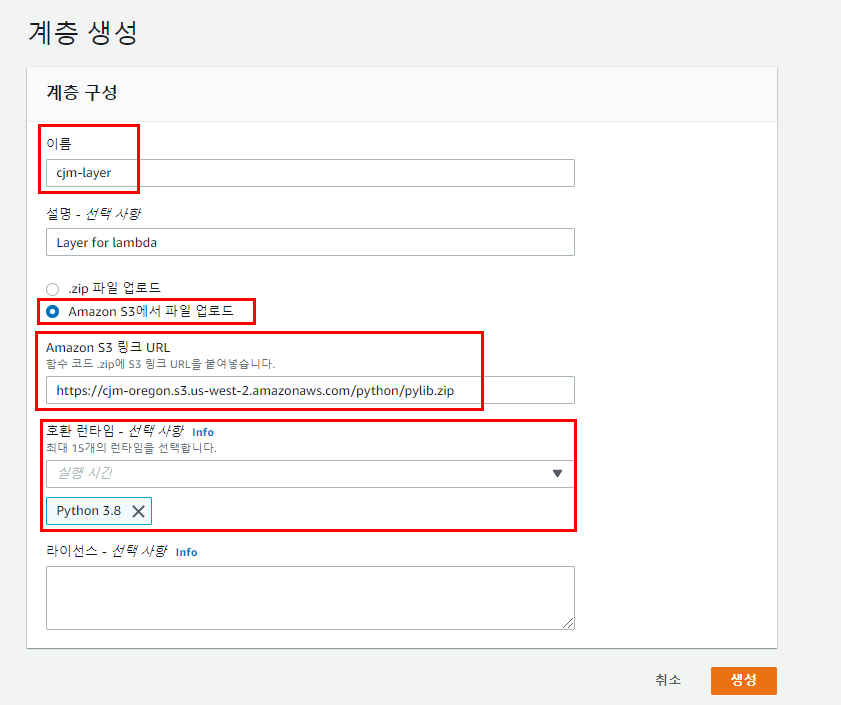

<div style="page-break-after: always; break-after: page;"></div>

#### Lambda function 생성

[Lambda function 생성 예시](../../Monitoring_stop/README.md)를 참고

변경 사항

- 실행 역할 : 앞성 생성한 Role

- code : 

  - [lambda_function.py](#code/lambda_function.py)
  - [essential.py](#code/essential.py)
  - [ec2.py](#code/ec2.py)
  - [rds.py](#code/rds.py)
  - [deletion.py](#code/deletion.py)

- 제한 시간 : 15분 (최대 수행 시간)

- Layer 연결 : 상단에서 생성한 Layer 연결

  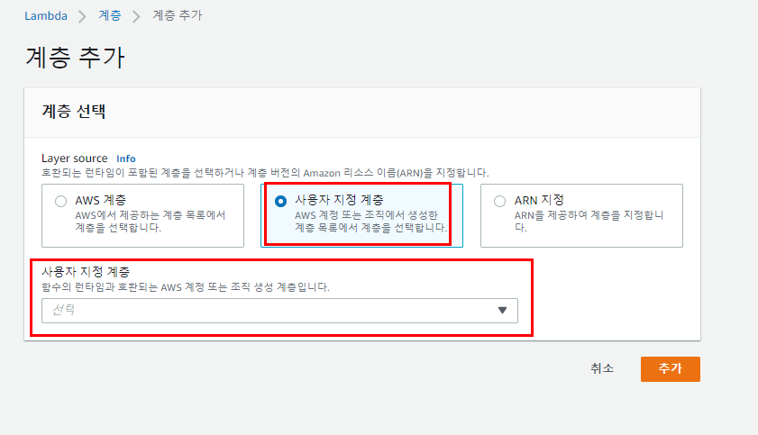

<div style="page-break-after: always; break-after: page;"></div>

### Step Function 생성

- 코드로 워크르로 작성

- 유형 : `표준`

- 정의 : [step function code](#code/stepfunction.json)

  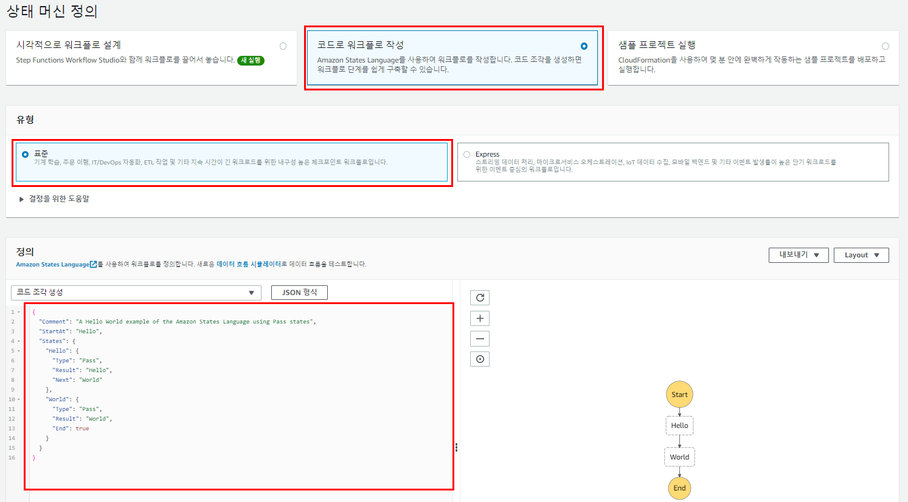

<div style="page-break-after: always; break-after: page;"></div>

### CloudWatch Event 생성

[CloudWatch Event 생성 예시](../../Monitoring_stop/README.md)를 참고

변경 사항

- 대상 : `Step Functions 상태 시스템`

- 입력 구성 : `상수(JSON 텍스트)

  ```json
  {
      "SENDER": [발신정보],
      "RECIPIENT": [수신정보],
      "AWS_REGION": [지역],
      "SUBJECT": [제목정보],
      "CHARSET": [인코딩 정보],
      "BUCKET": [Bucket 정보],
      "EXTENSION": [확장자명],
      "EXCEPT-KEY": [예외 목록],
      "TableName": [table 이름]
  }
  ```

- Role : 기존 역할 사용 (앞서 생성한 CloudWatch Role)

  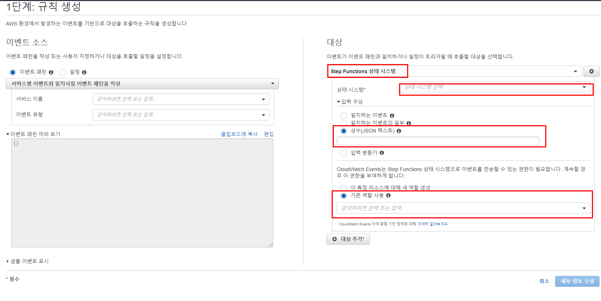

<div style="page-break-after: always; break-after: page;"></div>

## 3. Monitoring Unit Test

### Collect EC2 Tags

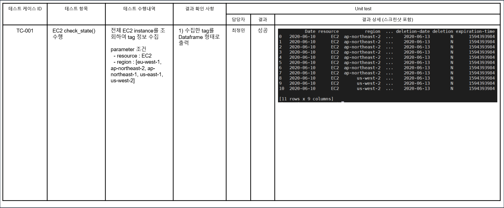

<div style="page-break-after: always; break-after: page;"></div>

### Collect RDS Tags

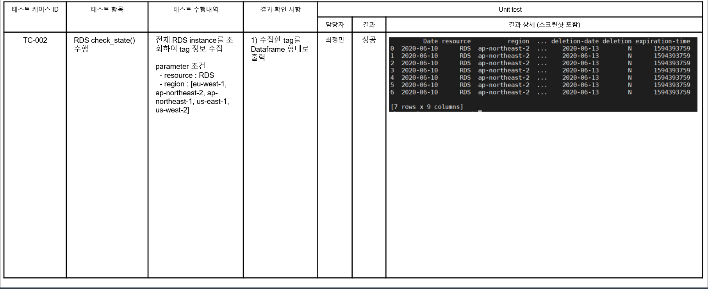

<div style="page-break-after: always; break-after: page;"></div>

### DynamoDB data upload

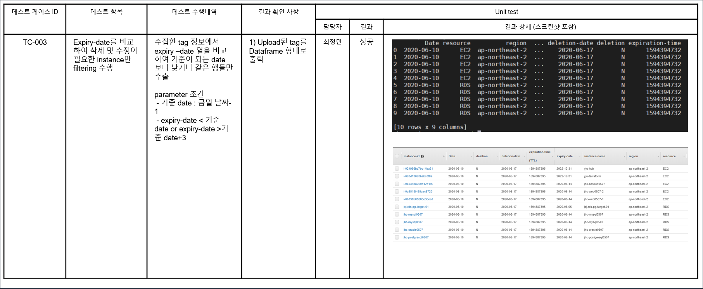

<div style="page-break-after: always; break-after: page;"></div>

### Read DynamoDB

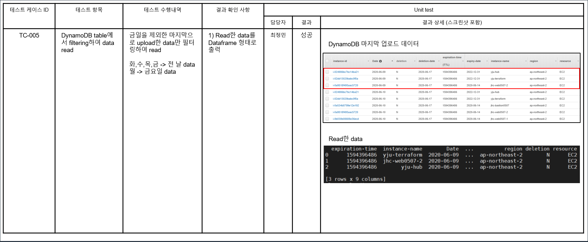

<div style="page-break-after: always; break-after: page;"></div>

### DeletionProtection

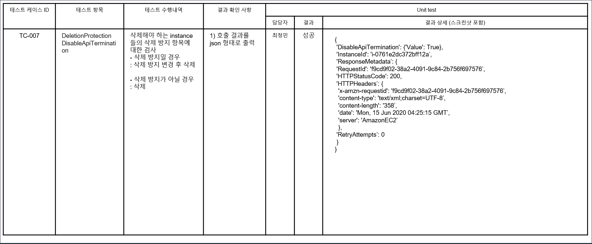

<div style="page-break-after: always; break-after: page;"></div>

### Deletion

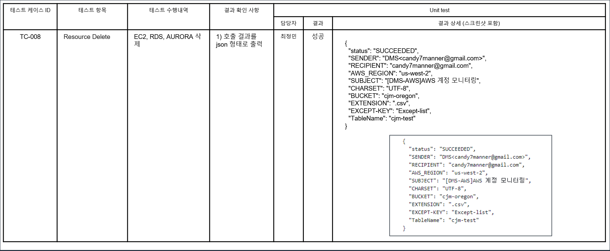
