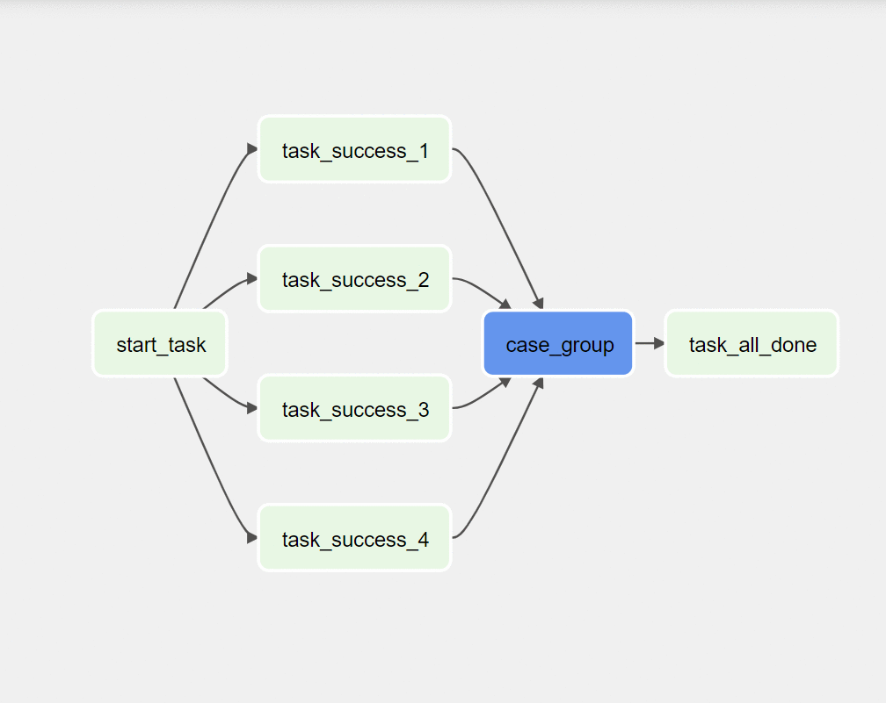
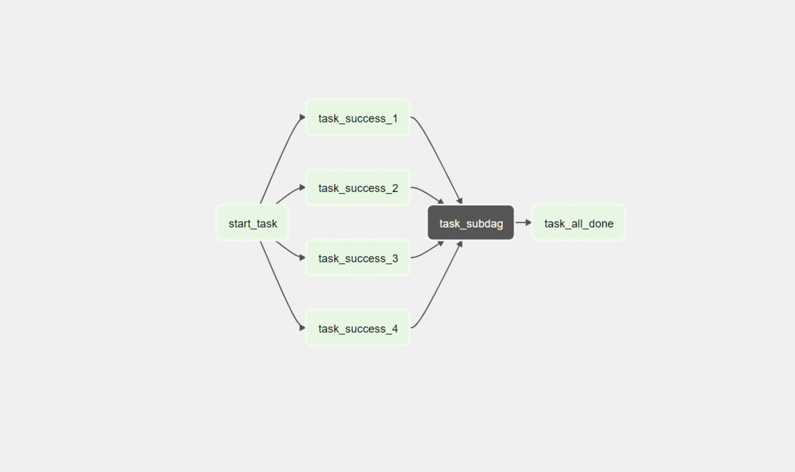
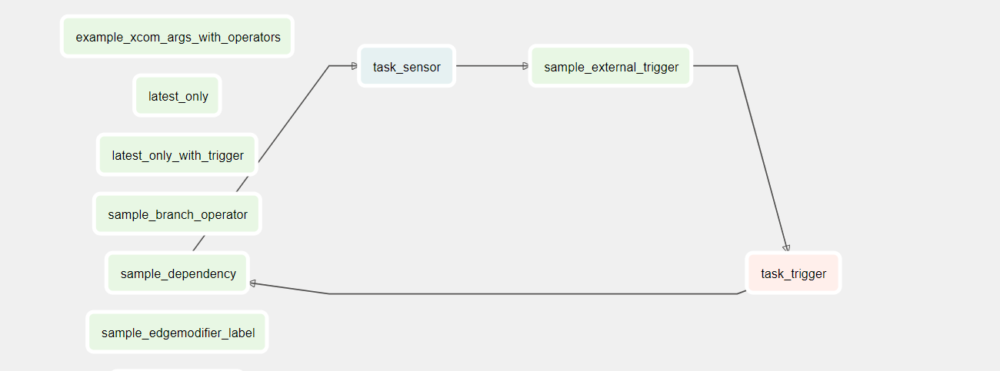

# DAG(Directed Acyclic Graph)란?

DAG (방향 비순환 그래프)
사전적 의미 : 방향 순환이 없는 무한 유향 그래프

즉, 무한히 수많은 꼭짓점과 간선으로 구성되며 각 간선은 하나의 꼭짓점에서 다른 꼭짓점으로 방향을 잇는데 어떠한 꼭짓점 v에서 시작하여 끝내 다시 v로 돌아가 순환 반복되지 않는 그래프

올바른 DAG 예)


틀린 DAG 예)


Airflow에서의 DAG는 순환하지 않으면서 각 Task들의 종속성과 절차를 나타낸 그래프이고 옵션에 따라 작업에 대한 시간 초과, 실행 방법 등을 적용시킬 수 있다.

<div style="page-break-after: always; break-after: page;"></div>

## 1. DAG 선언

Airflow는 Python을 기반으로 정의된 플랫폼 입니다. 
따라서 Airflow 각각의 Workflow를 정의하는 DAG도 python code들로 정의됩니다.
DAG를 선언한다는 것은 해당 DAG 내의 구성된 Task들의 작동 방식에 대해 사전에 정의하는 것입니다.

DAG Example

```python
default_args = {
    'owner': 'Jungmin',
    'depends_on_past': False,
    'start_date': datetime(2021,2,22),
    'provide_context' : True,
    'max_active_runs' : 30
}

dag = DAG(DAG_NAME,
    default_args=default_args,
    schedule_interval= '0 6 * * *',
    catchup=True,
    concurrency = 30,
    tags=[
        "Jungmin",
        "EMR_MANAGEMENT"
    ]
)
```

> 상단의 예시에서 볼 수 있는 것 처럼 Workflow의 Schedule이나 Owner, Tag등을 사전에 정의하여 정의된 dag를 할당한 Task들은 정의된 내용에 따라 수행하게 됩니다.
>
> 예를 들면 "task들 중 최초 노드는 매일 6시에 시작하고 동시에 수행할 수 있는 task는 30개까지 가능하다" 것이 할당된 task들에 적용이 된다.

DAG를 선언하는 방법에는 세 가지가 있습니다. 

1. Context Manager
   Context Manager `with`를 사용하여 DAG 내부에 암시적으로 DAG 리소스를 할당하고 제공합니다.

   ```python
   with DAG("my_dag_name") as dag:
       op = DummyOperator(task_id="task")
   ```

   상단의 예시문과 같이 `with`문을 통해 DAG를 선언하고 내부 블록내에서 각각의 Task들을 정의 할 수 있습니다.

   

2. Constructor
   표준 생성자를 생성하여 선언 후 각각의 Task에 할당할 수 있습니다.

   ```python
   my_dag = DAG("my_dag_name")
   op = DummyOperator(task_id="task", dag=my_dag)
   ```

   상단의 예시문과 같이 Task를 정의하는 Operator나 Sensor등의 `dag=` 옵션에 정의된 생성자를 전달하므로써 Task를 정의합니다.

   

3. `@dag` Decorator
   지난번에 나온 TaskFlow와 같이 Decorator를 할당하여 DAG를 선언합니다.

   ```python
   @dag(start_date=days_ago(2))
   def generate_dag():
       op = DummyOperator(task_id="task")
   
   dag = generate_dag()
   ```

모든 Task들은 DAG가 선언 및 할당되어야 하며 DAG 그 자체로는 별다른 역할을 할 수 없고 Task에 할당되므로써 역할을 수행할 수 있습니다.

<div style="page-break-after: always; break-after: page;"></div>

## 2. Control Flow

### 1. 종속성 제어

일반적으로 DAG는 단일 Task로는 구성되지 않으며 여러 Task들로 구성되는 각각의 Task들은 순서나 종속성을 가지게 됩니다. ( 예) First_task 이후 Secnod_task 수행) 
Control Flow는 정의된 Task들로 Task간의 종속성 및 DAG의 구조를 구성 및 Design하는 것입니다.

Control Flow를 Design 두 가지 주요 방법이 있고 세부적으로는 여러 방법이 있습니다.

- `>>`및`<<`연산자를 사용

  ```python
  # [상위 task] >> [하위 task]
  # or
  # [하위 task] >> [상위 task]
  
  first_task >> third_task
  first_task >> second_task
  third_task << fourth_task
  ```

  > 하나의 노드에서 다수의 노드로 종속되는 형태는 List 형태로 표현할 수 있습니다.

  ```python
  first_task >> [second_task, third_task]
  third_task << fourth_task
  ```

  > `1 : N` 또는 `N : 1`의 형태로 표현 가능합니다
  > ※  `N : N` 불가능 =>  [first_task, fourth_task] >> [second_task, third_task]

- `set_upstream`및 `set_downstream` 사용

  ```python
  # [상위 task].set_downstream([하위 task])
  # or
  # [하위 task].set_upstream([상위 task])
  
  first_task.set_downstream(second_task, third_task)
  third_task.set_upstream(fourth_task)
  ```

- `cross_downstream` 사용

  ```python
  from airflow.models.baseoperator import cross_downstream
  
  cross_downstream([op1, op2], [op3, op4])
  
  # 다른 표현1
  # [op1, op2] >> op3
  # [op1, op2] >> op4
  
  # 다른 표현2
  # op1 >> op3
  # op1 >> op4
  # op2 >> op3
  # op2 >> op4
  ```

  > 상단의 예시처럼 하위 task가 공통된 상위 task에 종속될 경우 예시와 같이 표현 가능합니다.
  >
  > 

  ```python
  from airflow.models.baseoperator import cross_downstream
  
  cross_downstream(from_tasks=[t1, t2, t3], to_tasks=[t4, t5, t6])
  ```

  > 

- `chain` 사용

  ```python
  from airflow.models.baseoperator import chain
  
  # task들을 순서에 따라 입력
  chain(op1, op2, op3, op4)
  
  # 다른 표현
  # op1 >> op2 >> op3 >> op4
  ```

  > chain을 사용하게 되면 Control Flow를 짧고 단순하게 표현 가능합니다.

  ```python
  from airflow.models.baseoperator import chain
  
  # 동적 표현
  chain([DummyOperator(task_id='op' + i) for i in range(1, 6)])
  
  # 다른 표현
  # op1 >> op2 >> op3 >> op4 >> op5 >> op6
  ```

  > 반복문인 for문을 사용하여 동적으로 task를 정의하고 표현할 수 있습니다.
  >
  > ※  Airflow는 DAG로 등록하기 전에 python code를 사전 수행 합니다. 
  > 따라서 상단의 예시에서는 chain 안의 list에 6개의 task가 생길 것 이라는 것을 예상할 수 있습니다.

  ```python
  from airflow.models.baseoperator import chain
  
  chain(op1, [op2, op3], [op4, op5], op6)
  
  # 다른 표현
  # op1 >> op2 >> op4 >> op6
  # op1 >> op3 >> op5 >> op6
  ```

  > 상단의 `>>`및`<<`연산자는 `N : N` 표현이 불가능했지만 chain에서는 표현 가능합니다.

<div style="page-break-after: always; break-after: page;"></div>

### 2. 수행 제어

기본적으로 DAG는 의존하는 모든 작업이 성공한 경우에만 작업을 실행합니다. 그러나 이를 수정하는 방법에는 여러 가지가 있습니다.

- BranchOperator : 조건에 따라 다음에 수행할 하위 task를 지정합니다.
- LatestOnlyOperator : 최신 Dag만 실행 하위 task를 skip합니다.
- Depends On Past : 여기서 작업은 이전 실행에서 자체적으로 종속될 수 *있습니다.*
- Trigger Rule : DAG가 작업을 실행할 조건을 설정할 수 있습니다.

#### 1. BranchOperator

종속된 하위 Task 중 조건에 따라 반환되는 task_id로 하위 task를 결정


`choice_task`에 따라 [`branch_a`, `branch_b`, `branch_c`, `branch_d`, `end_task`] 로 분기합니다.

예시 Code)

[BranchOperator](codes/sample_branch_operator.py)

<div style="page-break-after: always; break-after: page;"></div>

#### 2. Latest Only

Airflow는 지난 일자에 대한 Backfill(과거 데이터를 채워넣는 액션)을 지원합니다.
`LatestOnlyOperator` 를 사용하면 최신 Dag에 대해서만 수행하며 하위 task들도 지난 일자에 대한 수행은 skip 합니다.


이 DAG의 경우:

- `latest_only` 하위의 [`task1`, `task3`, `task4`] 최신 일자외의 과거에 대한 수행은 skip 합니다.
- `task2`는 `latest_only`와 독립적이며 하위 task들도 영향 받지 않습니다.


(Image_URL : https://airflow.apache.org/docs/apache-airflow/stable/_images/latest_only_with_trigger.png)

예시 Code)

[Latest Only](codes/sample_latest_only.py)

#### 3. Depands On Past

해당 DAG에 대해 과거 수행이력이 현재 수행에 대한 영향을 미치게 됩니다.
즉, 과거 수행이 성공일 경우에만 수행을 하는 옵션입니다.
단, 과거 이력이 없는 최초 수행일 경우 무시됩니다.

#### 4. Trigger Rule

각 Task 별 수행하기 전 상위 task들에 규칙을 지정하여 수행여부를 결정 할 수 있습니다.

- `all_success` (기본값): 모든 상위 Task가 성공할 경우 수행.
- `all_failed`: 모든 상위 Task가 `failed`또는 `upstream_failed`상태일 경우 수행
- `all_done`: 모든 상위 Task의 수행과 함께 완료될 경우 수행(`failed`나 `skipped`도 task 수행에 포함됨)
- `one_failed`: 최소한 하나의 상위 Task가 실패할 경우 ( 모든 상위 Task의 수행을 기다리지 않음 ).
- `one_success`: 최소한 하나의 상위 Task가 성공했습니다. ( 모든 상위 Task의 수행을 기다리지 않음 ).
- `none_failed`: 모든 상위 Task가 성공했거나 건너뛰었습니다.
- `none_failed_or_skipped`: 모든 상위 Task에는 `failed`또는 `upstream_failed` 가 없습니다
- `none_skipped`: 모든 상위 Task가 `skipped` 상태가 아닙니다
- `dummy`: 종속성이 전혀 없습니다. 언제든지 이 작업을 실행하십시오.


상단의 이미지는 모든 Trigger Rule을 적용한 DAG 입니다.

- `task_none_failed` 와 `task_none_failed_or_skipped` 상위 task `task_failed`가 Fail 상태이므로 `upstream_failed`
- `task_all_failed` 는 상위 task가 success or skipped 이므로 `skipped`
- `task_one_failed`는 상위 task `task_failed`가 Fail 상태이므로 `success`

예시 Code)

[Trigger Rule](codes/sample_trigger_rule.py)

<div style="page-break-after: always; break-after: page;"></div>

## 3. DAG 실행

DAG를 실행하는 방법에는 두 가지가 있습니다. 

- Manual Trigger
  

  > 상단 이미지와 같이 Webserver에 접근하여 `Trigger` 버튼을 클릭함으로써 DAG를 실행할 수 있습니다.

- Schedule
  `schedule_interval`인수를 통해 Schedule을 정의 할 수 있습니다.

  - 예약어

    ```python
    dag = DAG(
        dag_id='sample_trigger_rule',
        default_args=args,
        schedule_interval="@daily",
        tags=['trigger']
    )
    ```

  - cron expression

    ```python
    dag = DAG(
        dag_id='sample_trigger_rule',
        default_args=args,
        schedule_interval="0 * * * *",
        tags=['trigger']
    )
    ```

<div style="page-break-after: always; break-after: page;"></div>

## 4. 기본 인수

DAG를 선언할 때 다양한 옵션들이 존재합니다. 일반적으로 `default_args` 라는 인수 집합에 기본 옵션들을 정의하고 DAG와 함께 선언합니다. 선언된 인수들은 모든 task에 자동 적용됩니다.

```python
default_args = {
    'start_date': datetime(2016, 1, 1),
    'owner': 'airflow'
}

dag = DAG(
    dag_id='sample_trigger_rule',
    default_args=default_args,
    schedule_interval="0 * * * *",
    tags=['trigger']
)

start_task = DummyOperator(
    task_id='start_task',
    dag=dag
)
```

기본 인수는 DAG 생성자에서 선언되고 DAG 생성자는 각 task에 할당되므로 적용시킬 수 있습니다.

<div style="page-break-after: always; break-after: page;"></div>

## 5. 동적 DAG

앞서 설명했던 것처럼Airflow는 Python을 기반으로 정의된 플랫폼 입니다. 
따라서 반복문이나 조건문과 같은 로직으로 Dynamic하게 DAG를 design할 수 있습니다.


```python
options = ['branch_a', 'branch_b', 'branch_c', 'branch_d']
task_list = [BashOperator(task_id=option, bash_command="echo \'" + option + " done\' > " + txt_file, dag=dag) for option in options]
```

> 상단의 예시처럼 options라는 list를 for 반복문을 사용하여 3열의 task들을 동적으로 생성했습니다.

<div style="page-break-after: always; break-after: page;"></div>

## 6. DAG 시각화

Airflow는 각각의 DAG를 Graph Tab에서 UI로 표현 가능합니다.

2가지 방법으로 더 효과적인 시각화를 구현할 수 있습니다.

- TaskGroup
- Edgemodifier Label

### 1. TaskGroup

TaskGroup을 사용하여 그래프 보기에서 작업을 계층적 그룹으로 구성할 수 있습니다. 반복되는 패턴을 만들고 시각적 혼란을 줄이는 데 유용합니다.
그러나 TaskGroup은 순전히 UI 그룹화 개념입니다. workflow 상의 그룹화는 아니기 때문에 처리과정에서의 영향은 없습니다.



위의 예시 이미지는 상단의 Trigger Rule의 예시에서 사용했던 DAG에 TaskGroup을 적용한 사례입니다.
cross_downstream 으로 종속성을 표현했던 Task들을 TaskGroup으로 설정하면 UI 상에서 단순화 할 수 있습니다.
기존 Control Flow에서 설명했던 Chain으로는 Task Group을 표현할 수 없으므로 `>>`, `<<` 연산자를 사용해야합니다.

예시 Code)

[TaskGroup](codes/sample_taskgroup.py)

### 2. Edgemodifier Label

Task끼리의 종속성을 나타내는 Arrow에 Label을 지정하여 어떤 과정이었는지를 명시 할 수 있습니다. 이는 DAG의 분기 영역에 특히 유용할 수 있으므로 특정 분기가 실행될 수 있는 조건에 레이블을 지정할 수 있습니다.


하단의 이미지를 표현한 Control Flow

`>>`및 `<<`연산자 사용

```python
from airflow.utils.edgemodifier import Label
p
task_start >> Label("Add Succes Case") >> task_list >> Label("Case By Trigger") >> case_group >> Label("End Task") >> task_all_done
```

`set_upstream`, `set_downstream` 사용

```python
from airflow.utils.edgemodifier import Label

task_start.set_downstream(task_list, Label("Add Succes Case"))
task_list.set_downstream(case_group, Label("Case By Trigger"))
task_all_done.set_upstream(case_group, Label("Label("End Task")"))
```

예시 Code)

[Edgemodifier Label](codes/sample_edgemodifier_label.py)

<div style="page-break-after: always; break-after: page;"></div>

## 7. SubDAG

SubDAG는 TaskGroup과 달리 UI 뿐만 아니라 논리적으로도 그룹화하여 처리 과정에도 영향을 줍니다.

예) 기존의 복잡한 기존 작업


subdag를 추가한 작업


> Subdag 또한 DAG이기 떄문에 해당 Task에 Design된 모든 Workflow가 수행되어야 원래 DAG의 다음 Task로 넘어갈 수 있습니다.

`SubDagOperator`기본 DAG의 그래프 보기에서 확대 하여 SubDAG에 포함된 작업을 표시할 수 있습니다.



SubDAG를 유의사항:

- 규칙에 따라 SubDAG `dag_id`는 상위 DAG의 이름과 점( `parent.child`)을 접두사로 사용해야 합니다.
- SubDAG 는 기본 DAG의 Default_args를 공유합니다.
- SubDAG에는 일정이 있고 활성화되어 있어야 합니다. SubDAG의 일정이 `None`또는 로 설정된 `@once`경우 SubDAG는 아무 작업도 수행하지 않고 성공합니다.
- 성공으로 표시해도 `SubDagOperator`그 안의 작업 상태에는 영향을 미치지 않습니다.
- SubDAG에 대한 Executor를 지정할 수 있습니다. SubDAG의 기본 Executor는 SequentialExecutor 입니다.
  SubDAG 내부의 Task들을 병렬로 진행하려면 LocalExecutor 와 같은 다른 Executor를 지정해야합니다.

예시 Code)

[SubDAG](codes/sample_subdag.py)

<div style="page-break-after: always; break-after: page;"></div>

## 8. DAG 종속성

DAG의 Task 간의 종속성은 Control Flow를 통해 명시적으로 정의됩니다.
일부 Operator, Sensor를 사용하여 DAG 간의 종속성정의 할 수 있습니다.

- 트리거 - `TriggerDagRunOperator` : DAG가 다른 DAG를 trigger 할 수 있습니다.
- 기다리다 - `ExternalTaskSensor` : DAG가 다른 DAG의 수행여부를 상태체크 합니다.

**DAG Dependency**는 DAG 간의 종속성을 시각화로 확인하는 데 도움이됩니다. 종속성은 DAG 직렬화 중에 스케줄러에 의해 계산되고 웹 서버는 이를 사용하여 종속성 그래프를 작성합니다.`Menu -> Browse -> DAG Dependencies`



예시 Code)

[TriggerDagRunOperator](codes/sample_external_trigger.py)
[ExternalTaskSensor](codes/sample_external_trigger.py)

<div style="page-break-after: always; break-after: page;"></div>

## 과제

제시된 DAG에 하단 이미지와 같이 Control flow Design 및 Code 제출

[DAG Code](codes/assignment.py)


